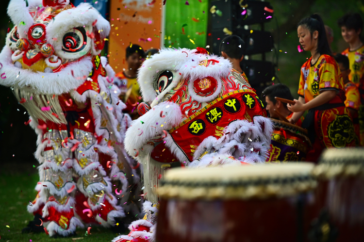

# To Know About Lunar New Year and How It's Celebrated Across Asia

**The Lunar New Year** is a public holiday that is observed across multiple days in Asia. Filial ties typically take center stage during this time as people return to their hometowns to observe the holiday with their families. Each country has different culture to celebrate the Lunar New Year. *Involving travel to reunite with family, being the Year of the Rabbit, eating food which plays a special role, and giving money from Elders to young people.*

> Students put red envelopes containing money, known locally as "ang pao," into the mouth of the "barongsai," or lion dance, during Lunar New Year celebrations at a school in Solo, Central Java, Indonesia.

-   Lunar New Year is known by different names in different countries. For example, in China it is called Chūn Jié, in Vietnam it is known as Tết, in Korea it is Seollal and in Tibet it is called Losar.
-   2023 is the Year of the Rabbit by following the Chinese zodiac. It represents to be the luckiest of all the animals, and to be calm, peaceful people with artistic and sensitive temperaments.
-   Red is the most popular color for Lunar New Year celebrations because of its traditional associations with happiness and good fortune, wealth and auspiciousness.
